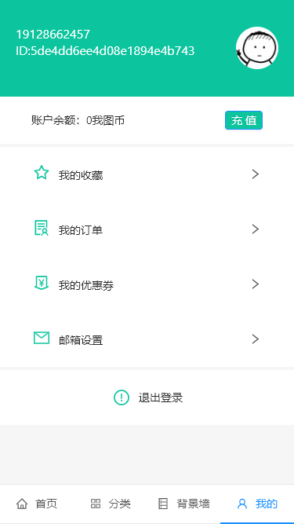
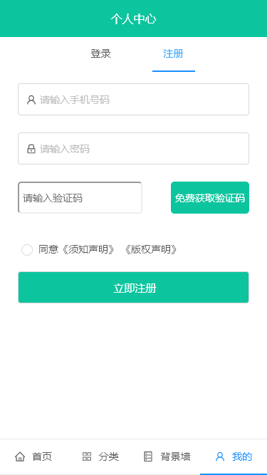
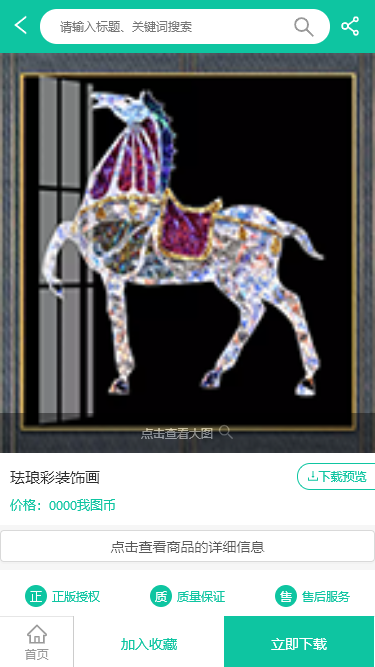
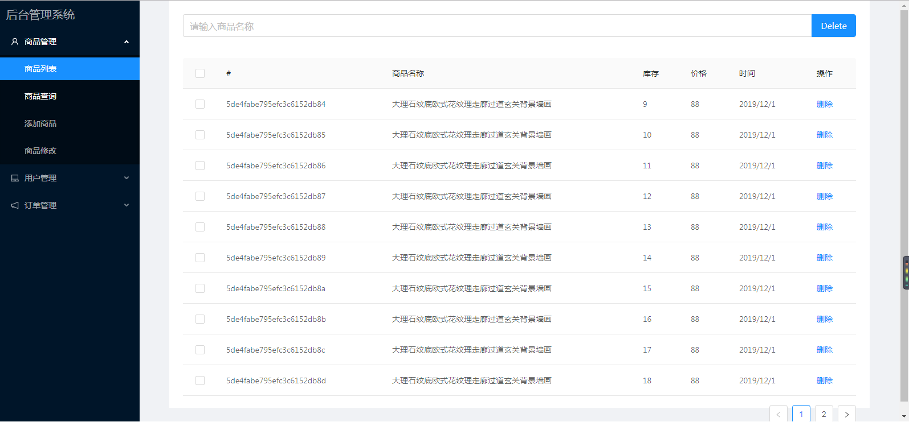
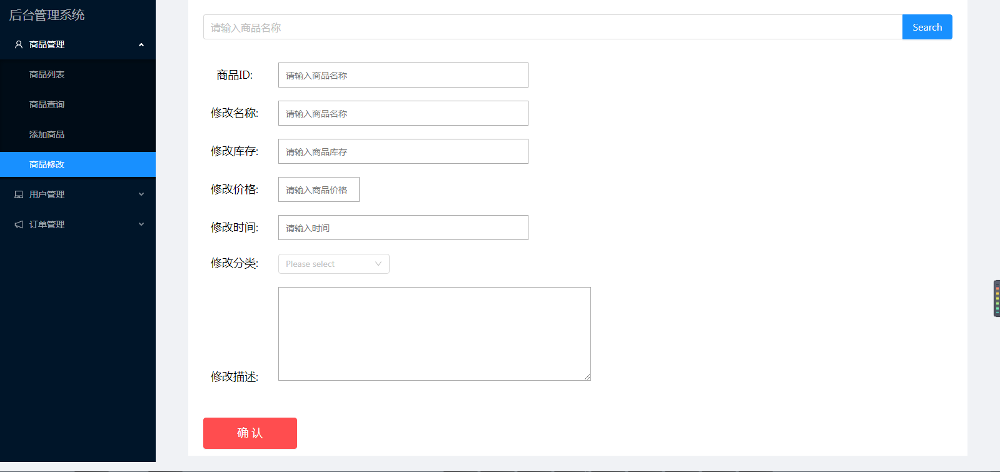

### 我图网

> 项目介绍：我图网是一个设计作品交易平台，主要经营正版设计稿，正版摄影图，正版插画，正版3d模型，正版flash源文件等销售。
## 演示
```js
* 官网：https://m.ooopic.com/

* 上线网址：http://121.199.11.112:8011

* 后台管理网址：http://121.199.11.112:8010

* git仓库地址: https://github.com/gzh51910/IFiGureTheNet
```
### 团队
```
* 组长：韦云洪
* 成员：董伟东、梁洪铭
```
### 负责模块说明：
```
* 韦云洪：页面布局、交互、优化、
* 董伟东：页面渲染、交互、爬取数据、编写接口
* 梁洪铭：后台管理模块、爬取数据
```
## 项目页面截图

* 首页：
* 
* 分类：
* 
* 背景墙：
* 
* 我的：
* 
* 登录：
* 
* 注册：
* 
* 商品详情：
* 
* 商品列表：
* 
* 后台：
* 
* 后台：
* 

## 项目目录说明

├─WoTu                  项目文件夹
    ├─image             页面截图
    |
    ├─serverApi         服务器
        ├─db            连接服务器文件
        ├─routers       后台接口
        ├─utils         工具
    |
    └─wotu              app前端文件夹
        ├─component     封装的组件
        ├─css           页面样式
        ├─pages         页面
        ├─store         redux 存放共享的数据
        ├─routers       //路由
        └─utils         //token
      